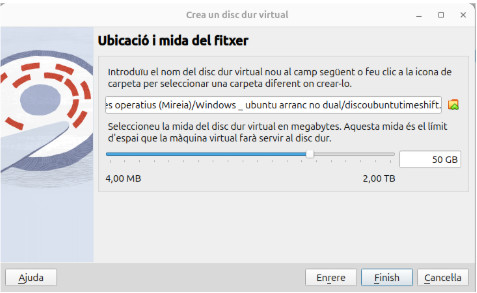

# Màquina virtual dual Ubuntu - Windows
## Configuració de VirtualBox

Per tal de poder realitzar la instal·lació d'Ubuntu, i com que no podem fer-ho sobre una màquina física, hem d'utilitzar l'aplicació anomenada VirtualBox per tal de poder realitzar la instal·lació del sistema operatiu. L'elecció d'aquesta aplicació i no una altra com VMware és que aquesta és de codi lliure i gratuïta, i per tant no és necessària la compra de cap llicència.

### Creació de la màquina virtual

Com ja hem dit, per a la màquina virtual s'ha utilitzat l'aplicació VirtualBox. A continuació s'exposarà la configuració que s'ha realitzat per tal de crear la màquina virtual.


#### Apartat 1 General

En aquest primer apartat, únicament el que es fa és escriure el nom que se li vol donar a la màquina virtual i el mateix VirtualBox, si el nom està relacionat amb el sistema operatiu a instal·lar, ja li assigna el tipus de sistema operatiu a instal·lar.

#### Apartat 2 Sistema

- **Memòria RAM:** S'han assignat 8 GB de RAM, suficient per a poder fer funcionar correctament un Ubuntu Desktop i més que de sobres en aquest cas donat que per a la instal·lació del sistema operatiu n’hi ha prou, i a més l’equip amfitrió disposa de 32 GB de RAM.

- **Processador:** En aquest cas s'han assignat 2 CPU, suficient per a la instal·lació del sistema operatiu i el seu posterior funcionament. Amb 2 CPU es permet el funcionament del sistema operatiu virtual i de l'amfitrió, i d'aquesta manera es poden executar més d'una màquina virtual de forma simultània sense una pèrdua considerable de rendiment.

- **Ordre d'arrencada:** Quant a l'ordre d'arrencada es deixa l'opció per defecte que dona l'aplicació i que és perfectament vàlida per a l'arrencada.

- **EFI:** Aquesta opció, actualment, ja és recomanable activar-la en tot moment. Bàsicament el que fa és que en instal·lar el sistema operatiu aquest reconegui que “l'ordinador” sobre el qual es realitza la instal·lació ja disposa d’UEFI i no de BIOS. Per això és l'opció recomanada, ja que en l'actualitat tots els equips moderns funcionen amb UEFI i no amb BIOS.

- **Acceleració:** Aquí és on es pot configurar com s'utilitzen les funcionalitats de virtualització del processador de l’equip amfitrió. Aquests paràmetres influeixen en el rendiment i la compatibilitat de la màquina virtual.

#### Apartat 3 Pantalla

- **Memòria de vídeo:** Des d'aquesta opció es pot assignar quina serà la quantitat de memòria que VirtualBox assignarà a la màquina virtual. Aquest apartat afecta la qualitat d'imatge, el rendiment i les funcionalitats multimèdia. En aquest cas, s'han assignat 16 MB donat que només es realitzarà la instal·lació. El normal seria aplicar-hi 128 MB, que és el màxim aplicable. Si s'activés l'opció de 3D llavors es podria arribar fins a 256 MB, però inicialment únicament s'ha assignat el mínim funcional.

- **Controlador de gràfics:** Aquesta opció ofereix diferents controladors de vídeo virtuals. Depenent de la versió del sistema operatiu cal assignar un tipus o un altre de controlador. En el cas d’Ubuntu cal assignar el que es veu a la imatge, és a dir **VMSVGA**, que és el més adequat per a instal·lacions de Linux.

- **Servei d'escriptori remot:** Per defecte no ve activat. En cas d'activar-ho, aquesta opció permet accedir a la màquina virtual de manera remota com si estiguessis davant de la seva pantalla. Treballa amb el protocol VRDP, que és una extensió del RDP de Microsoft.

- **Enregistrament:** Aquesta opció, desactivada per defecte, permet realitzar una gravació de la màquina virtual en un format multimèdia útil per a documentar processos, formació o demostracions.

#### Apartat 4 Emmagatzematge

Aquest apartat és un dels més importants de la creació de la màquina virtual. Aquí és on es poden afegir, eliminar i configurar els dispositius d'emmagatzematge que tindrà la màquina virtual, com ara discos durs i unitats òptiques.

- **Controlador:** En aquest cas ens trobem amb dos apartats: el relacionat amb el lector de CD, que per defecte ve amb una unitat IDE (sistema obsolet) però que encara funciona. Si fos necessari es pot canviar per un de SATA més adequat i actual, però en aquest cas no és obligatori el canvi. Aquí és on li assignarem la imatge ISO que tenim de l'Ubuntu per tal que realitzi la instal·lació.  
  Per l'altre costat hi ha el controlador SATA, que aquest sí que és el sistema més actual i on s’assigna el disc dur virtual que s'ha creat abans (80 GB en aquest cas) i que és on es col·locaran totes les dades de la màquina virtual. De cara a l'Ubuntu és el que seria el disc dur. El sistema permet l'assignació de múltiples discos durs virtuals així com de diversos lectors.

#### Apartat 5 Àudio

Aquest apartat normalment no es modifica i, com el seu nom indica, s'encarrega d'assignar la targeta de so per a la màquina virtual per tal de poder treballar amb sons. Normalment només s’activa o desactiva depenent del que es vulgui aconseguir.

#### Apartat 6 Xarxa

Aquest apartat permet configurar com la màquina virtual es connectarà a la xarxa i a Internet. En aquest cas s'ha escollit l'opció de **NAT**, donat que la màquina rep una IP privada dins d'una xarxa virtual interna, cosa que permet que la màquina virtual no ocupi IPs de la xarxa existent. Així, depenent de les configuracions aplicades a la màquina virtual, aquestes no afectaran la xarxa ni els equips externs a la màquina virtual.  
VirtualBox permet assignar diferents modalitats de configuració de xarxa: NAT, Bridged (adaptador pont), Internal Network, Host-only i NAT Network, cadascuna amb les seves característiques.

Per a mes informació sobre les diferents opcions de xarxa de Virtualbox es pot consultar el fitxer [xarxes_virtualbox.md](xarxes_virtualbox.md)

#### Apartat 7 USB

En aquest apartat hi trobem la configuració per als ports USB que disposarà la màquina virtual, podent assignar-hi ports USB 2.0, 3.0, etc. Amb aquesta opció es poden gestionar els dispositius USB físics, permetent que el sistema Ubuntu, en aquest cas, els vegi com si estiguessin connectats a ell mateix i no a l'amfitrió.

#### Apartat 8 Carpetes compartides

Les carpetes compartides permeten que una màquina virtual accedeixi a carpetes o directoris de l’ordinador amfitrió com si fossin unitats locals dins del sistema convidat. Això facilita enormement l’intercanvi de dades sense haver de copiar-les amb memòries USB ni utilitzar xarxa.

## Instal·lació del sistema operatiu Ubuntu

Revisades les opcions de la màquina virtual, es comença amb la instal·lació de l'Ubuntu. Per això es polsa sobre el botó d’inicialitzar i comença la instal·lació del sistema operatiu. Dins de les parts de la instal·lació es mencionaran les més importants.  
En primer lloc apareix la pantalla per a escollir si volem instal·lar-lo o només provar-lo.


Arribats a aquesta pantalla gairebé inicial, aquí és on es pot escollir l'idioma del sistema operatiu i després si el que es vol fer és la instal·lació o només provar-lo, que seria el mateix que generar un sistema operatiu portable i que en aturar-lo desapareix completament. En aquest cas polsarem sobre el botó **Instal·lar Ubuntu** i començarà la instal·lació del sistema operatiu.

Continuant amb la instal·lació finalment s'arriba a la pantalla possiblement més important de la instal·lació: la creació de les particions. Les particions finalment han quedat de la següent manera:


### Esquema de particions per a la instal·lació d’Ubuntu

Durant la instal·lació d’Ubuntu, s’ha optat per la **creació manual de particions**, definint un esquema adaptat a un disc dur virtual de 80 GB. Aquest esquema permet al sistema funcionar correctament i tenir una bona organització dels espais de memòria.

#### Particions creades

- **/dev/sda1 → Partició EFI (799 MB, tipus ext4)**
  - Aquesta partició és necessària quan s’utilitza el sistema d’arrencada **UEFI**, que és la que s'ha activat a l'hora de crear la màquina virtual.  
  - Conté els fitxers essencials perquè l’ordinador pugui iniciar el carregador d’arrencada (GRUB en el cas d’Ubuntu).  
  - Encara que sembli petita, és suficient i imprescindible per a l’arrencada del sistema.

- **/dev/sda2 → Partició arrel “/” (38 GB, ext4)**
  - Aquesta és la partició principal on s’instal·la el sistema operatiu.  
  - Conté tots els directoris del sistema (`/home`, `/bin`, `/etc`, etc.) i les aplicacions.  
  - S’ha escollit el sistema de fitxers **ext4**, el més habitual en Linux, ja que és robust, eficient i amb bona gestió de journaling.

- **/dev/sda3 → Partició swap (4 GB)**
  - Espai reservat per al **swap**, que actua com a memòria virtual addicional quan la memòria RAM física no és suficient.  
  - També és útil per permetre la funció d’**hibernació** (guardar l’estat de la sessió al disc).  
  - En aquest cas s’han assignat 4 GB, una mida adequada per a un sistema amb 8 GB de RAM com el de la màquina virtual.
  - Per a mes informació sobre la particio swap es pot lleguir el fitxer [particio_swap.md](particio_swap.md)

- **Espai lliure (43.098 MB)**
  - Encara hi ha espai disponible al disc dur virtual per crear noves particions si cal, per exemple:
    - Una partició **/home** separada per a les dades dels usuaris. En aquest cas no s'ha creat aquesta partició, per la qual cosa quedarà inclosa a la partició arrel.  
    - Una partició addicional per a proves o altres sistemes.  

#### El sistema de particions en Linux

En Linux, a diferència de Windows, no s’utilitzen lletres de unitat (com `C:` o `D:`).  
Tot el sistema s’organitza sota un únic **arbre de directoris**, que comença a l’**arrel “/”**.  

- **/** → Punt de muntatge principal (arrel).  
- **/boot o EFI** → Fitxers d’arrencada del sistema.  
- **/home** → Carpeta dels usuaris (opcions de configuració i fitxers personals).  
- **swap** → Espai de memòria virtual.  

Aquest model flexible permet dividir el disc en diferents particions segons les necessitats, millorant el rendiment, la seguretat i la gestió del sistema.

---

#### Resum

En aquest cas s’ha creat un esquema simple però funcional:
- **EFI** per a l’arrencada.  
- **/** com a partició principal del sistema i carpeta **home** (38 GB).  
- **swap** per a memòria virtual (4 GB).  
- **Espai lliure** per a futures ampliacions.  

Aquesta organització garanteix que Ubuntu s’instal·li correctament i que el sistema pugui arrencar i funcionar amb estabilitat.

Després de la creació de les particions ja s'inicia la instal·lació del sistema operatiu i es configuren la resta d'opcions de la instal·lació. Ja gairebé al final només queda la creació de l'usuari i el nom que se li donarà a l’equip.


### Creació de l’usuari principal a Ubuntu

Aquesta pantalla estableix tant la informació d’identitat com les credencials que s’utilitzaran per iniciar sessió i administrar el sistema.

#### Camps configurables

- **El seu nom**: Es tracta del nom complet de la persona usuària (en aquest cas, *Jesus*).  
  Aquest nom es mostra en l’entorn gràfic i a les pantalles de benvinguda.

- **El nom de l’equip**: Identifica l’ordinador dins de la xarxa.  
  En aquest cas, s’ha assignat *jesus-VirtualBox*, de manera que altres dispositius poden reconèixer aquest equip quan es connecta a una xarxa.

- **Nom d’usuari**: És l’identificador que s’utilitza per iniciar sessió i a la terminal.  
  Sol ser en minúscules i sense espais (per exemple, *jesus*).  
  Aquest usuari tindrà permisos d’administració mitjançant l’ordre `sudo`.

- **Contrasenya**: Clau d’accés que protegeix l’usuari.  
  Ha de ser prou robusta (combinació de lletres, números i símbols) per garantir la seguretat del sistema.  
  També es demana repetir-la per evitar errors de tecleig.

#### Opcions d’inici de sessió

- **Iniciar sessió automàticament**: L’usuari accedeix al sistema sense introduir la contrasenya cada vegada que arrenca l'ordinador.  
  Pot ser còmode, però menys segur.

- **Sol·licitar contrasenya per iniciar sessió**: El sistema demana sempre la contrasenya en arrencar.  
  És l'opció **més recomanada** per protegir l'equip i les dades.

- **Utilitzar Active Directory**: Permet connectar l’ordinador a un **domini corporatiu de Microsoft Active Directory**.  
  Aquesta opció no és necessària en entorns domèstics o d’ús personal, però sí en xarxes d’empresa on els usuaris i permisos es gestionen centralitzadament.

#### Importància d’aquest pas

Aquest és un dels punts més importants de la instal·lació:
- Es defineix **l’usuari principal** del sistema, que serà l’administrador inicial.  
- Es configura la **seguretat d’accés** amb una contrasenya robusta.  
- Es determina com es **presentarà l’equip a la xarxa** (nom de l’ordinador).  

Una configuració correcta aquí garanteix que el sistema estigui protegit i preparat per treballar tant en entorns personals com en xarxes més grans.

Després d’això ja tindríem configurat l'Ubuntu i només quedaria la personalització de l'usuari perquè aparegui la pantalla de l'escriptori i puguem donar per acabada la instal·lació del sistema operatiu. Després d’acabar la instal·lació seria necessària la instal·lació de les **Guest Additions** i les actualitzacions corresponents.

## Instal·lacio del sistema operatiu Windows a la màquina virtual

### Introducció
Acabada la instal·lacio i configuració de l'Ubuntu, a continuacio li toca el torn al Windows. Per tal de poder realitzar la instal·lació del Windows a la mateixa maquina virtual, cal que aquesta inicialment hagui estat feta sobre una configuracio on el disc dur ha d'estar configurat amb format GPT i no amb MBR per a poder instal·lar posteriorment el Windows en aquest cas com que la instal·lació inicial de l'ubuntu ja ha estat realitzat aixi, llavors ja es compatible per a la instal·lacio del windows 10 en aquest cas.


Això és el que demostra que la instal·lació de l'Ubuntu inicial ja està instal·lat sobre un disc amb la configuració amb el sistema GPT

### instal·lació del sistema operatiu

Ara ja comença la instal·lació del Windows 10. Per a fer-ho cal anar a la configuració i a l’apartat de l'emmagatzematge afegir l'ISO del Windows 10 perquè en arrancar la màquina virtual ja arranqui directament amb Windows. També s’ha de canviar la targeta gràfica que hi tenim assignat donat que el format que dona VirtualBox per a Linux no és compatible amb Windows i no es podrà veure la imatge al Windows 10, per tant, es realitza el canvi corresponent.


Un cop iniciada la instal·lació s’arriba a la pantalla de les particions, en aquest cas es polsa sobre la partició que tenim sense utilitzar i es polsa sobre Siguiente per a la instal·lació del Windows. En fer-ho així, el mateix sistema ja crea les particions reglamentàries i continua amb la instal·lació.

Finalitzada la instal·lació del Windows 10 i aquest ja funciona correctament, es procedeix a la recuperació de l’arrancada perquè aquest sigui dual

### Recuperació del GRUB d'Ubuntu

Com és normal, en instal·lar Windows damunt de l’Ubuntu, aquest ha eliminat el GRUB i ara només detecta el Windows. Això es pot revertir únicament restaurant el GRUB, el qual un cop restaurat ja ens hauria de detectar també el Windows i aplicarà un arrancat dual per als dos sistemes operatius. Aquesta recuperació es pot arribar a realitzar pel vist de diverses maneres, però en aquest cas s’utilitzarà la següent que es passarà a aplicar. 

En primer lloc, cal arrancar amb una ISO d’Ubuntu, però en aquest cas no s’utilitzarà 
la instal·lació del mateix si no la part del **live cd**.


Com ja hem dit, en arribar a aquesta pantalla es polsa sobre la icona Probar Ubuntu i iniciem el sistema operatiu en mode Live CD. Un cop ja arrancat, en primer lloc, s’ha de localitzar la partició on està instal·lat Ubuntu, per a saber-ho es posa la comanda sudo fdisk -l perquè ens mostri totes les particions del disc.


Tal com es pot apreciar al resultat de la comanda, ens mostra que la partició que tenim instal·lat Ubuntu és a /dev/sda2 i la part de l’arrancada es troba a /dev/sda1. Com que ja se sap on estan les particions, ara cal muntar-les les dues. Per a fer-ho s’utilitzaran les següents comandes.

```bash
sudo mount /dev/sda2 /mnt
sudo mount /dev/sda1 /mnt/boot/efi
```

Després de fer al muntatge, cal enganxar els directoris del sistema al chroot, per a fer-ho es posaran les següents comandes.

``` bash
sudo mount --bind /dev /mnt/dev
sudo mount --bind /proc /mnt/proc
sudo mount --bind /sys /mnt/sys
sudo mount --bind /run /mnt/run
``` 

Després cal entrar al chroot amb la comanda

``` bash
sudo chroot /mnt
```

A continuació caldrà actualitzar el GRUB I els fitxers EFI amb la comanda

``` bash
grub-install --target=x86_64-efi --efi-directory=/boot/efi --bootloader-id=ubuntu update-grub
```
Després només caldrà sortir del chroot i desmuntar les particions que hem muntat abans amb les comandes.

``` bash
exit
sudo umount /mnt/dev
sudo umount /mnt/proc
sudo umount /mnt/sys
sudo umount /mnt/run
sudo umount /mnt/boot/efi
sudo umount /mnt
```

I ja per acabar només queda reiniciar l’equip i si tot ha anat correctament ja hauria de sortir l’arrancada dual. Finalment i després del reinici, s’ha recuperat l’arrancada de l’Ubuntu, però no apareix l’arrancada dual. Per a arreglar-ho, es forçarà que el GRUB faci una actualització perquè mostri la partició de Windows. Per a fer-ho s’utilitzaran les següents comandes.

``` bash
sudo apt install os-prober	(En aquest cas ja estava instal·lat però per si de cas)
```

Comprovat que ho tenim, s’ha d’editar el fitxer de configuració del GRUB amb la comanda

``` bash
sudo nano /etc/default/grub
```


Dintre del fitxer s’ha de buscar la línia **GRUB_DISABLE_OS_PROBER=false**.
Tal com es pot apreciar a la imatge es troba a l’última línia, però en aquest cas s’ha hagut d’afegir donat que no hi existia. Un cop afegit es guarden els canvis i és surt del fitxer de configuració del GRUB.


A continuació cal tornar a generar el GRUB. Per a fer-ho cal posar la comanda **sudo update grub**. Com es pot veure a la imatge anterior, a posar la comanda aquest realitza els passos corresponents i ja si es mira es pot apreciar com apareix la línia on diu que ha trobat una instal·lació de Windows. Arribats aquí ja només ens queda reiniciar l’equip per a comprovar sí això és així.


I com es pot comprovar ara en iniciar el sistema operatiu ja ens mostra directament el GRUB amb les opcions d’arrancada entre les que s’aprecien la d’Ubuntu i a la tercera línia ens mostra la línia amb el sistema Windows. Després de provar-ho, s’han pogut iniciar els dos sistemes operatius sense problemes aparents.

# Virtual amb dos sistemes operatius amb arrancada independent

## Configuració de VirtualBox

Per tal de crear l’activitat primer es crearà una màquina virtual amb la següent configuració.


Inicialment, a la imatge es pot observar com quedarà la màquina virtual amb els dos discs durs de 50 GB per a la instal·lació dels dos sistemes operatius i la resta de la configuració. Només cal remarcar que per a evitar problemes a l’hora de la instal·lació i que un sistema operatiu afecti l’altre, a continuació es realitzarà l'eliminació d’un dels discs dur per tal d’evitar problemes i errades.

Després un cop instal·lat el sistema operatiu es farà la inversa, es desconectara el disc dur per a que detecti l'altre i instal·lar l’altre sistema operatiu. Un cop els dos sistemes operatius instal·lats llavors ja es tornarà a posar els dos discs durs i després sobre el bios del VirtualBox s'inicialitzarà un sistema o l’altre.

## Particionat del disc de l’Ubuntu

A causa del fet que la instal·lació que s’ha realitzat a les màquines virtuals no hi havia uns requisits concrets com en la màquina anterior, s’ha fet una instal·lació per defecte i sense realitzar cap variació, per la qual cosa doncs no s’ha pogut realitzar una captura de pantalla en el moment de la realització de les particions corresponents.

Per aquesta raó i després de la finalització d'aquesta, he executat la comanda sudo parted -l per a fer una captura de pantalla i veure com ha quedat les particions amb totes les dades relacionades amb el particionat i sistema de fitxers de la màquina virtual.


A la imatge es poden apreciar les particions generades així com que la taula de particions està generada amb GPT. De la resta de la instal·lació no s’han agafat imatges donat que com ja s’ha dit abans la instal·lació ha estat tota per defecte.

## Particionat del disc del Windows 10

En el cas de la instal·lació del Windows 10 sobre la màquina virtual, aquest s’ha realitzat igual que amb el disc d’Ubuntu, és a dir, tot per defecte. En fer-ho així, la instal·lació quan arriba a l’apartat de les particions, aquesta no mostra com es generen, ja que aquest fa un particionat adaptant-se a les capacitats del disc dur, per la qual cosa, no s’ha pogut realitzar una captura de pantalla en el moment de la realització.

Per aquesta raó, i ja amb el sistema operatiu instal·lat, es procedeix a la realització d’una captura de pantalla per tal de mostrar com ha quedat el particionat.


En aquest cas amb Windows s’ha utilitzat la comanda diskpart, ja que ens permet accedir a totes les dades, inclús es pot apreciar com aquest detecta els dos discs durs de la màquina virtual, i aquest ens mostra com les dues particions estan en el format GPT així com les diferents particions que ha generat el mateix Windows 10 durant la instal·lació.

## Entrada a la bios per a canviar entre sistemes operatius

Com ja se sap, aquesta màquina hi ha els dos sistemes operatius, però no estan dualitzats, per aquesta raó no hi ha manera de què en inicialitzar puguem triar entre un sistema operatiu o l’altre. Llavors això amb una màquina física es podria fer de la mateixa manera que es fa aquí a la màquina virtual.

En aquest cas, Virtualbox també ens dona l’opció d’accedir al bios i des d’allí poder escollir si es vol arrancar amb Ubuntu o si es vol arrancar amb Windows. Per a accedir al bios de la màquina virtual cal polsar la tecla F2 del teclat. Això sí, s’ha de fer mooolt ràpid i abans i tot de què aparegui a la pantalla o si no, no hi haurà forma de poder-hi entrar.


En entrar al bios la primera pantalla que ens apareix és la imatge anterior, la configuració del bios no és ni de bon tros com podria ser la d’una bios d’un equip físic, però sí que dona les opcions necessàries per al que necessitem en aquest cas. Per a modificar l’arrancada es polsarà sobre l’opció que hi ha seleccionada anomenada Boot Manager.


En accedir a la pantalla ja ens mostra totes les opcions que hi ha disponibles per a realitzar l’arrancada. En el cas d’aquesta màquina virtual ens mourem entre la quarta i quinta línia que són les dues instal·lacions que hi ha creades. A la quarta fila es troba la que fa que arranqui Windows 10 i la quinta fila és la que s’encarrega que arranqui l’Ubuntu. Inicialment, s’hauria de poder modificar l’arrancada per defecte, però per ara no s’aplicarà aquí.

# Llicenciament

Per tal de veure el llicenciament d'Ubuntu es pot llegir el fitxer [license.md](license.md)

Per tal de veure el llicenciament del GitHub es pot llegir el fitxer [license.md](../LICENSE.md)

# Punts de restauració

Per tal de poder realitzar aquesta tasca, en primer lloc, s’haura de crear un disc dur per a afegir a la màquina virtual donat que la copia no es possible ni recomanable fer-ho des de la mateixa unitat.



Després de crear el disc dur (virtual), caldrà afegir-lo a la màquina virtual perquè aquest el detecti.


Després d’afegir el disc dur a la màquina virtual, només queda iniciar el sistema per tal d’afegir aquest disc dur per a poder-lo utilitzar després a la tasca que hem de realitzar. 


Un cop ja iniciat entrem a la consola i, en primer lloc, es posa la comanda sudo fdisk -l per a veure on ha quedat el disc dur que acabem d’afegir. Al resultat de la comanda es veu com el disc afegit aquesta localitza a /dev/sdc.

A continuació el següent ja és particionar el disc i formatar-lo amb la comanda fdisk.


Les comandes utilitzades han estat les següents.
``` bash
sudo fdisk /dev/sdc
	n (nova partició)
	p (partició primària)
	1 (predeterminat)
	Primer sector (predeterminat)
	Last sector (predeterminat)
	w (guarda els canvis i surt de fdisk)
```

Després de particionar el disc es procedeix al formatatge. Per a fer-ho es posaran la següent comanda.


Posant la comanda sudo mkfs.ext4 /dev/sdc1, que és la partició que s’ha creat al pas anterior, aquesta ha quedat formatada en el format ext4 de Linux i ja està a punt per a ser utilitzada.

Un cop ja hi ha el segon disc dur a punt, a continuació cal instal·lar el següent programa.


Per a realitzar instantànies, es procedeix a la instal·lació de l’aplicació Timeshift. Aquesta s’ha realitzat mitjançant la comanda sudo apt install timeshift com es pot apreciar a la imatge anterior.

El pròxim pas sirà la creació d’un fitxer


Dintre de la carpeta Descargas s’ha creat el fitxer arxiu_a_borrar. Aquest fitxer, després de fer la instantània s’esborrarà i amb la posterior restauració hauria de tornar a aparèixer.  Un cop dintre de l’aplicació polsarem sobre el botó d’assistent per tal de crear una configuració per a la creació de la instantània.


En posar en funcionament l’assistent, en primer lloc, demana el tipus d'instantània, en aquest cas s’ha de posar RSYNC, ja que amb aquest permet copiar fitxers que no són de sistema.


El següent pas és on es vol guardar els fitxers que es generaran les instantànies.


El següent pas ja és seleccionar el tipus d'instantània, en aquest cas se li dirà que es faci en Arrancar el sistema operatiu i en un parell de còpies ja és suficient.


I finalment ja es diu si es volen agafar les carpetes personals de l’usuari. Finalment, ja i després d’una pantalla on informa de diverses coses relacionades en les còpies ja queda guardada la instantània i es reinicia l’equip perquè aquesta es posi en funcionament.


S’ha generat la instantània correctament, per la qual cosa s’esborra l’arxiu creat per a comprovar que la còpia s’ha realitzat correctament.


Esborrat el fitxer, es procedeix a la restauració de la instantània realitzada.


L’aplicació mostra el que modificarà, es polsa sobre Siguiente per a continuar.


Finalment i posat el filtre a crear, el sistema ja ens diu que tornarà a crear aquests dos fitxer que pel vist detecta que no hi són, per la qual cosa els restaurarà. I finalment després de fer la comprovació efectivament el fitxer que s’ha esborrat torna a estar al seu lloc, per la qual cosa la instantània ha funcionat correctament.

# Configuració de la xarxa

Per tal de realitzar la configuració de la xarxa, en primer lloc, es posarà la comanda ip a per tal de saber la IP que hi ha a la màquina virtual. Com que la targeta de xarxa està en pont, la IP que ens apareixerà és la que ens ha donat el DHCP de l’aula.


Tal com es pot apreciar, la IP és la 192.168.203.220/24. Després de saber la IP a continuació es posarà a la part gràfica de l’Ubuntu a la configuració de la xarxa per a posar la mateixa IP, però en aquest cas en configuració manual.


Posada la configuració es guarden els canvis i a continuació es comprovarà si funciona internet.


Després de comprovar amb la comanda ip a per a comprovar com ha quedat la configuració, per a acabar de comprovar que la configuració està correcta es realitza un ping a la IP 8.8.8.8, com es pot comprovar el ping és correcte, per la qual cosa la configuració ha quedat establerta de forma correcta.

Després de fer el canvi per la part gràfica, ara es realitzarà el mateix, però per la part de línia de comandes a la configuració per a quan no hi ha entorn gràfic.


Per a fer la configuració de la xarxa des del terminal cal utilitzar Netplan. Per a fer-ho cal editar els fitxers de configuració situats a la carpeta /etc/netplan/


Un cop dintre de la carpeta es pot observar que el fitxer a modificar és el que s’anomena 01-network-manager-all.yaml. Per a modificar-lo s’aplica la comanda sudo nano 01-network-manager-all.yaml

La configuració per defecte d’aquest fitxer seria una com la següent:

```bash
network:
  version: 2
  ethernets:
    enp0s3:
      dhcp4: true
```

Finalment, el fitxer ha quedat de la següent manera.


Després d’aplicar la configuració i comprovar que no hi han errades, amb la comanda sudo netplan apply, la configuració ja queda fixada. Si després es va a l’apartat gràfic de la configuració de xarxa, aquesta ha quedat de la següent manera.


En aquesta configuració, el fitxer de Netplan defineix el renderer com a NetworkManager, de manera que la gestió de la xarxa passa al servei gràfic de NetworkManager.

Això provoca que, tot i indicar una IP estàtica al fitxer YAML, l’entorn gràfic mostri la interfície com a automàtica (DHCP). Això és degut al fet que NetworkManager té prioritat sobre la configuració de Netplan.

Després de fer les comprovacions, es torna a deixar la configuració per defecte al fitxer netplan per a poder tornar a fer funcionar la xarxa amb DHCP.

# Comandes generals i instal·lacions

Fins ara quan s’ha instal·lat una aplicació s’ha realitzat basant-nos en els paquets que hi ha al repositori d’Ubuntu, però aquest repositori, no sempre té les últimes versions o la versió necessària. Llavors si el que es vol és instal·lar una versió que no sigui la que correspon i poder triar la versió que un vulgui, per a fer això possible és quan cal aplicar el Pinning Packet

Això és un mecanisme del sistema de paquets APT que permet forçar o triar determinades versions de paquets provinents de repositoris diferents o de versions concretes.

Per tal d'instal·lar una aplicació amb aquest sistema cal seguir els següents passos. En primer lloc, cal mirar les versions de l’aplicació que hi ha al sistema disponible.

La comanda a aplicar seria: apt-cache policy nom_aplicacio.

Com a exemple es podria posar l’aplicació Audacity que és un reproductor de vídeo. Per tant, en primer lloc, es faria la comprovació amb la comanda apt-cache policy audacity


En aquest cas, el sistema ens diu que l’aplicació no es troba dintre del sistema instal·lat, i ens mostra que hi ha dues versions disponibles. També ens mostra que per defecte si es posés sudo apt install audacity s'instal·laria la versió 3.4.2, ja que el número 500 i el 100 com es pot observar, són els paràmetres que ens indiquen la prioritat a l’hora de fer la instal·lació.

Com que el 500 és el número més alt, aquest seria el que per defecte instal·laria APT. Una altra informació important que ens mostra és de quin repositori s'instal·laria cada aplicació.

En aquest cas el que es realitzarà és la instal·lació que és més actualitzada, però que com pel que fa a instal·lació és la segona opció hem de forçar que sigui aquesta la que s’instal·larà.

Per tal de fer-ho així, caldrà posar la següent comanda: **sudo apt install audacity/noble-backports**


En aplicar la comanda, es pot apreciar com s’ha modificat la versió per defecte que teníem predeterminada, i ara apt ja ens mostra que s'instal·larà la versió 3.7.3 com se li ha dit, ens mostra els paquets que instal·larà i a continuació ja se li diu que si perquè es faci la instal·lació.


Després d’acabar la instal·lació si es torna a posar la comanda sudo apt-cache policy audacity, ja ens mostra que ara sí que està instal·lada l’aplicació i que la versió és la 3.73 i no la 3.4.2 que seria la que s'hagués instal·lat per defecte.
