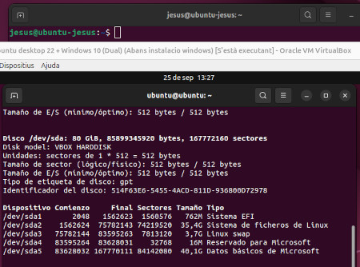

# Màquina virtual dual Ubuntu - Windows
## Configuració de VirtualBox

Per tal de poder realitzar la instal·lació d'Ubuntu, i com que no podem fer-ho sobre una màquina física, hem d'utilitzar l'aplicació anomenada VirtualBox per tal de poder realitzar la instal·lació del sistema operatiu. L'elecció d'aquesta aplicació i no una altra com VMware és que aquesta és de codi lliure i gratuïta, i per tant no és necessària la compra de cap llicència.

### Creació de la màquina virtual

Com ja hem dit, per a la màquina virtual s'ha utilitzat l'aplicació VirtualBox. A continuació s'exposarà la configuració que s'ha realitzat per tal de crear la màquina virtual.


#### Apartat 1 General

En aquest primer apartat, únicament el que es fa és escriure el nom que se li vol donar a la màquina virtual i el mateix VirtualBox, si el nom està relacionat amb el sistema operatiu a instal·lar, ja li assigna el tipus de sistema operatiu a instal·lar.

#### Apartat 2 Sistema

- **Memòria RAM:** S'han assignat 8 GB de RAM, suficient per a poder fer funcionar correctament un Ubuntu Desktop i més que de sobres en aquest cas donat que per a la instal·lació del sistema operatiu n’hi ha prou, i a més l’equip amfitrió disposa de 32 GB de RAM.

- **Processador:** En aquest cas s'han assignat 2 CPU, suficient per a la instal·lació del sistema operatiu i el seu posterior funcionament. Amb 2 CPU es permet el funcionament del sistema operatiu virtual i de l'amfitrió, i d'aquesta manera es poden executar més d'una màquina virtual de forma simultània sense una pèrdua considerable de rendiment.

- **Ordre d'arrencada:** Quant a l'ordre d'arrencada es deixa l'opció per defecte que dona l'aplicació i que és perfectament vàlida per a l'arrencada.

- **EFI:** Aquesta opció, actualment, ja és recomanable activar-la en tot moment. Bàsicament el que fa és que en instal·lar el sistema operatiu aquest reconegui que “l'ordinador” sobre el qual es realitza la instal·lació ja disposa d’UEFI i no de BIOS. Per això és l'opció recomanada, ja que en l'actualitat tots els equips moderns funcionen amb UEFI i no amb BIOS.

- **Acceleració:** Aquí és on es pot configurar com s'utilitzen les funcionalitats de virtualització del processador de l’equip amfitrió. Aquests paràmetres influeixen en el rendiment i la compatibilitat de la màquina virtual.

#### Apartat 3 Pantalla

- **Memòria de vídeo:** Des d'aquesta opció es pot assignar quina serà la quantitat de memòria que VirtualBox assignarà a la màquina virtual. Aquest apartat afecta la qualitat d'imatge, el rendiment i les funcionalitats multimèdia. En aquest cas, s'han assignat 16 MB donat que només es realitzarà la instal·lació. El normal seria aplicar-hi 128 MB, que és el màxim aplicable. Si s'activés l'opció de 3D llavors es podria arribar fins a 256 MB, però inicialment únicament s'ha assignat el mínim funcional.

- **Controlador de gràfics:** Aquesta opció ofereix diferents controladors de vídeo virtuals. Depenent de la versió del sistema operatiu cal assignar un tipus o un altre de controlador. En el cas d’Ubuntu cal assignar el que es veu a la imatge, és a dir **VMSVGA**, que és el més adequat per a instal·lacions de Linux.

- **Servei d'escriptori remot:** Per defecte no ve activat. En cas d'activar-ho, aquesta opció permet accedir a la màquina virtual de manera remota com si estiguessis davant de la seva pantalla. Treballa amb el protocol VRDP, que és una extensió del RDP de Microsoft.

- **Enregistrament:** Aquesta opció, desactivada per defecte, permet realitzar una gravació de la màquina virtual en un format multimèdia útil per a documentar processos, formació o demostracions.

#### Apartat 4 Emmagatzematge

Aquest apartat és un dels més importants de la creació de la màquina virtual. Aquí és on es poden afegir, eliminar i configurar els dispositius d'emmagatzematge que tindrà la màquina virtual, com ara discos durs i unitats òptiques.

- **Controlador:** En aquest cas ens trobem amb dos apartats: el relacionat amb el lector de CD, que per defecte ve amb una unitat IDE (sistema obsolet) però que encara funciona. Si fos necessari es pot canviar per un de SATA més adequat i actual, però en aquest cas no és obligatori el canvi. Aquí és on li assignarem la imatge ISO que tenim de l'Ubuntu per tal que realitzi la instal·lació.  
  Per l'altre costat hi ha el controlador SATA, que aquest sí que és el sistema més actual i on s’assigna el disc dur virtual que s'ha creat abans (80 GB en aquest cas) i que és on es col·locaran totes les dades de la màquina virtual. De cara a l'Ubuntu és el que seria el disc dur. El sistema permet l'assignació de múltiples discos durs virtuals així com de diversos lectors.

#### Apartat 5 Àudio

Aquest apartat normalment no es modifica i, com el seu nom indica, s'encarrega d'assignar la targeta de so per a la màquina virtual per tal de poder treballar amb sons. Normalment només s’activa o desactiva depenent del que es vulgui aconseguir.

#### Apartat 6 Xarxa

Aquest apartat permet configurar com la màquina virtual es connectarà a la xarxa i a Internet. En aquest cas s'ha escollit l'opció de **NAT**, donat que la màquina rep una IP privada dins d'una xarxa virtual interna, cosa que permet que la màquina virtual no ocupi IPs de la xarxa existent. Així, depenent de les configuracions aplicades a la màquina virtual, aquestes no afectaran la xarxa ni els equips externs a la màquina virtual.  
VirtualBox permet assignar diferents modalitats de configuració de xarxa: NAT, Bridged (adaptador pont), Internal Network, Host-only i NAT Network, cadascuna amb les seves característiques.

Per a mes informació sobre les diferents opcions de xarxa de Virtualbox es pot consultar el fitxer [xarxes_virtualbox.md](xarxes_virtualbox.md)

#### Apartat 7 USB

En aquest apartat hi trobem la configuració per als ports USB que disposarà la màquina virtual, podent assignar-hi ports USB 2.0, 3.0, etc. Amb aquesta opció es poden gestionar els dispositius USB físics, permetent que el sistema Ubuntu, en aquest cas, els vegi com si estiguessin connectats a ell mateix i no a l'amfitrió.

#### Apartat 8 Carpetes compartides

Les carpetes compartides permeten que una màquina virtual accedeixi a carpetes o directoris de l’ordinador amfitrió com si fossin unitats locals dins del sistema convidat. Això facilita enormement l’intercanvi de dades sense haver de copiar-les amb memòries USB ni utilitzar xarxa.

## Instal·lació del sistema operatiu Ubuntu

Revisades les opcions de la màquina virtual, es comença amb la instal·lació de l'Ubuntu. Per això es polsa sobre el botó d’inicialitzar i comença la instal·lació del sistema operatiu. Dins de les parts de la instal·lació es mencionaran les més importants.  
En primer lloc apareix la pantalla per a escollir si volem instal·lar-lo o només provar-lo.


Arribats a aquesta pantalla gairebé inicial, aquí és on es pot escollir l'idioma del sistema operatiu i després si el que es vol fer és la instal·lació o només provar-lo, que seria el mateix que generar un sistema operatiu portable i que en aturar-lo desapareix completament. En aquest cas polsarem sobre el botó **Instal·lar Ubuntu** i començarà la instal·lació del sistema operatiu.

Continuant amb la instal·lació finalment s'arriba a la pantalla possiblement més important de la instal·lació: la creació de les particions. Les particions finalment han quedat de la següent manera:


### Esquema de particions per a la instal·lació d’Ubuntu

Durant la instal·lació d’Ubuntu, s’ha optat per la **creació manual de particions**, definint un esquema adaptat a un disc dur virtual de 80 GB. Aquest esquema permet al sistema funcionar correctament i tenir una bona organització dels espais de memòria.

#### Particions creades

- **/dev/sda1 → Partició EFI (799 MB, tipus ext4)**
  - Aquesta partició és necessària quan s’utilitza el sistema d’arrencada **UEFI**, que és la que s'ha activat a l'hora de crear la màquina virtual.  
  - Conté els fitxers essencials perquè l’ordinador pugui iniciar el carregador d’arrencada (GRUB en el cas d’Ubuntu).  
  - Encara que sembli petita, és suficient i imprescindible per a l’arrencada del sistema.

- **/dev/sda2 → Partició arrel “/” (38 GB, ext4)**
  - Aquesta és la partició principal on s’instal·la el sistema operatiu.  
  - Conté tots els directoris del sistema (`/home`, `/bin`, `/etc`, etc.) i les aplicacions.  
  - S’ha escollit el sistema de fitxers **ext4**, el més habitual en Linux, ja que és robust, eficient i amb bona gestió de journaling.

- **/dev/sda3 → Partició swap (4 GB)**
  - Espai reservat per al **swap**, que actua com a memòria virtual addicional quan la memòria RAM física no és suficient.  
  - També és útil per permetre la funció d’**hibernació** (guardar l’estat de la sessió al disc).  
  - En aquest cas s’han assignat 4 GB, una mida adequada per a un sistema amb 8 GB de RAM com el de la màquina virtual.
  - Per a mes informació sobre la particio swap es pot lleguir el fitxer [particio_swap.md](particio_swap.md)

- **Espai lliure (43.098 MB)**
  - Encara hi ha espai disponible al disc dur virtual per crear noves particions si cal, per exemple:
    - Una partició **/home** separada per a les dades dels usuaris. En aquest cas no s'ha creat aquesta partició, per la qual cosa quedarà inclosa a la partició arrel.  
    - Una partició addicional per a proves o altres sistemes.  

#### El sistema de particions en Linux

En Linux, a diferència de Windows, no s’utilitzen lletres de unitat (com `C:` o `D:`).  
Tot el sistema s’organitza sota un únic **arbre de directoris**, que comença a l’**arrel “/”**.  

- **/** → Punt de muntatge principal (arrel).  
- **/boot o EFI** → Fitxers d’arrencada del sistema.  
- **/home** → Carpeta dels usuaris (opcions de configuració i fitxers personals).  
- **swap** → Espai de memòria virtual.  

Aquest model flexible permet dividir el disc en diferents particions segons les necessitats, millorant el rendiment, la seguretat i la gestió del sistema.

---

#### Resum

En aquest cas s’ha creat un esquema simple però funcional:
- **EFI** per a l’arrencada.  
- **/** com a partició principal del sistema i carpeta **home** (38 GB).  
- **swap** per a memòria virtual (4 GB).  
- **Espai lliure** per a futures ampliacions.  

Aquesta organització garanteix que Ubuntu s’instal·li correctament i que el sistema pugui arrencar i funcionar amb estabilitat.

Després de la creació de les particions ja s'inicia la instal·lació del sistema operatiu i es configuren la resta d'opcions de la instal·lació. Ja gairebé al final només queda la creació de l'usuari i el nom que se li donarà a l’equip.


### Creació de l’usuari principal a Ubuntu

Aquesta pantalla estableix tant la informació d’identitat com les credencials que s’utilitzaran per iniciar sessió i administrar el sistema.

#### Camps configurables

- **El seu nom**: Es tracta del nom complet de la persona usuària (en aquest cas, *Jesus*).  
  Aquest nom es mostra en l’entorn gràfic i a les pantalles de benvinguda.

- **El nom de l’equip**: Identifica l’ordinador dins de la xarxa.  
  En aquest cas, s’ha assignat *jesus-VirtualBox*, de manera que altres dispositius poden reconèixer aquest equip quan es connecta a una xarxa.

- **Nom d’usuari**: És l’identificador que s’utilitza per iniciar sessió i a la terminal.  
  Sol ser en minúscules i sense espais (per exemple, *jesus*).  
  Aquest usuari tindrà permisos d’administració mitjançant l’ordre `sudo`.

- **Contrasenya**: Clau d’accés que protegeix l’usuari.  
  Ha de ser prou robusta (combinació de lletres, números i símbols) per garantir la seguretat del sistema.  
  També es demana repetir-la per evitar errors de tecleig.

#### Opcions d’inici de sessió

- **Iniciar sessió automàticament**: L’usuari accedeix al sistema sense introduir la contrasenya cada vegada que arrenca l'ordinador.  
  Pot ser còmode, però menys segur.

- **Sol·licitar contrasenya per iniciar sessió**: El sistema demana sempre la contrasenya en arrencar.  
  És l'opció **més recomanada** per protegir l'equip i les dades.

- **Utilitzar Active Directory**: Permet connectar l’ordinador a un **domini corporatiu de Microsoft Active Directory**.  
  Aquesta opció no és necessària en entorns domèstics o d’ús personal, però sí en xarxes d’empresa on els usuaris i permisos es gestionen centralitzadament.

#### Importància d’aquest pas

Aquest és un dels punts més importants de la instal·lació:
- Es defineix **l’usuari principal** del sistema, que serà l’administrador inicial.  
- Es configura la **seguretat d’accés** amb una contrasenya robusta.  
- Es determina com es **presentarà l’equip a la xarxa** (nom de l’ordinador).  

Una configuració correcta aquí garanteix que el sistema estigui protegit i preparat per treballar tant en entorns personals com en xarxes més grans.

Després d’això ja tindríem configurat l'Ubuntu i només quedaria la personalització de l'usuari perquè aparegui la pantalla de l'escriptori i puguem donar per acabada la instal·lació del sistema operatiu. Després d’acabar la instal·lació seria necessària la instal·lació de les **Guest Additions** i les actualitzacions corresponents.

## Instal·lacio del sistema operatiu Windows a la màquina virtual

### Introducció
Acabada la instal·lacio i configuració de l'Ubuntu, a continuacio li toca el torn al Windows. Per tal de poder realitzar la instal·lació del Windows a la mateixa maquina virtual, cal que aquesta inicialment hagui estat feta sobre una configuracio on el disc dur ha d'estar configurat amb format GPT i no amb MBR per a poder instal·lar posteriorment el Windows en aquest cas com que la instal·lació inicial de l'ubuntu ja ha estat realitzat aixi, llavors ja es compatible per a la instal·lacio del windows 10 en aquest cas.


Això és el que demostra que la instal·lació de l'Ubuntu inicial ja està instal·lat sobre un disc amb la configuració amb el sistema GPT

### instal·lació del sistema operatiu

Ara ja comença la instal·lació del Windows 10. Per a fer-ho cal anar a la configuració i a l’apartat de l'emmagatzematge afegir l'ISO del Windows 10 perquè en arrancar la màquina virtual ja arranqui directament amb Windows. També s’ha de canviar la targeta gràfica que hi tenim assignat donat que el format que dona VirtualBox per a Linux no és compatible amb Windows i no es podrà veure la imatge al Windows 10, per tant, es realitza el canvi corresponent.


Un cop iniciada la instal·lació s’arriba a la pantalla de les particions, en aquest cas es polsa sobre la partició que tenim sense utilitzar i es polsa sobre Siguiente per a la instal·lació del Windows. En fer-ho així, el mateix sistema ja crea les particions reglamentàries i continua amb la instal·lació.

Finalitzada la instal·lació del Windows 10 i aquest ja funciona correctament, es procedeix a la recuperació de l’arrancada perquè aquest sigui dual

### Recuperació del GRUB d'Ubuntu

Com és normal, en instal·lar Windows damunt de l’Ubuntu, aquest ha eliminat el GRUB i ara només detecta el Windows. Això es pot revertir únicament restaurant el GRUB, el qual un cop restaurat ja ens hauria de detectar també el Windows i aplicarà un arrancat dual per als dos sistemes operatius. Aquesta recuperació es pot arribar a realitzar pel vist de diverses maneres, però en aquest cas s’utilitzarà la següent que es passarà a aplicar. 

En primer lloc, cal arrancar amb una ISO d’Ubuntu, però en aquest cas no s’utilitzarà 
la instal·lació del mateix si no la part del **live cd**.


Com ja hem dit, en arribar a aquesta pantalla es polsa sobre la icona Probar Ubuntu i iniciem el sistema operatiu en mode Live CD. Un cop ja arrancat, en primer lloc, s’ha de localitzar la partició on està instal·lat Ubuntu, per a saber-ho es posa la comanda sudo fdisk -l perquè ens mostri totes les particions del disc.



Tal com es pot apreciar al resultat de la comanda, ens mostra que la partició que tenim instal·lat Ubuntu és a /dev/sda2 i la part de l’arrancada es troba a /dev/sda1. Com que ja se sap on estan les particions, ara cal muntar-les les dues. 

Per a fer-ho s’utilitzaran les següents comandes.
```bash
sudo mount /dev/sda2 /mnt
sudo mount /dev/sda1 /mnt/boot/efi
``


# Llicenciament

Per tal de veure el llicenciament d'Ubuntu es pot llegir el fitxer [license.md](license.md)

Per tal de veure el llicenciament del GitHub es pot llegir el fitxer [license.md](../LICENSE.md)

# Gestors d'arrencada per a instal·lacions DUALS
# Punts de restauració
# Configuració de la xarxa
# Comandes generals i instal·lacions
