# Sistemes de fitxers i particions
En aquest apartat es comentarà en primer lloc tot el relacionat amb els Sistemes de fitxers i les particions. En primer lloc es podria dir que el **Sistema de fitxers** és el conjunt de regles i estructures que utilitza el sistema operatiu per emmagatzemar, organitzar i accedir als fitxers dins d’un dispositiu d’emmagatzematge (com un disc dur, SSD o memòria USB). **Exemples**: FAT32, NTFS, ext4, HFS+, APFS, exFAT.

I les **Particions** son les divisions lògiques d’un disc físic que permeten separar dades o instal·lar diversos sistemes operatius. Cada partició pot tenir el seu propi sistema de fitxers.

## Mida sector

El **sector** és la unitat mínima física d’una unitat d’emmagatzemament on es guarden les dades. Per defecte són  512 bytes. És la mida més petita que el maquinari pot llegir o escriure directament.

## Mida block

El **bloc**, anomenat en sistemes operatius com Linux, o també anomenat **clúster** en sistemes operatius Windows, és la unitat lògica mínima amb què el sistema operatiu i el sistema de fitxers gestionen les dades.

Quan un fitxer s’emmagatzema, ocupa almenys un bloc complet.
* **Mida habitual:** 1 KB, 2 KB, 4 KB o 8 KB.
* **Controlat pel sistema de fitxers** (NTFS, ext4, FAT32...).
* **Es pot definir o modificar** quan es formateja el disc.
* **Cada bloc** està format per un o més sectors físics.
* **Mides grans** més velocitat amb fitxers grans.
* **Mides petites** millor aprofitament amb fitxers petits.

## Fragmentació interna

La **fragmentació interna** succeeix quan un fitxer no omple completament el bloc assignat. L’espai no utilitzat dins del bloc es perd, ja que el bloc no es pot compartir entre dos fitxers.

```
Exemple: un fitxer de 3 KB en un bloc de 4 KB deixa 1 KB desaprofitat.
Si hi ha molts fitxers petits, la pèrdua d’espai pot ser considerable.
```
Aquesta fragmentació és inevitable, ja que els blocs són d’una mida fixa. Els sistemes moderns intenten minimitzar-ne l’impacte ajustant la mida de bloc.

## Fragmentació externa

La fragmentació externa apareix quan un fitxer no pot ser emmagatzemat en blocs contigus, i el sistema ha de dividir-lo en diverses parts disperses pel disc. Això fa que el capçal del disc dur hagi de moure’s més per llegir el fitxer complet, reduint el rendiment.

```
En discs SSD, aquest problema no afecta gaire, ja que no hi ha parts mòbils. En disc durs mecanics, és recomanable fer desfragmentació periòdica per reorganitzar els blocs contigus. Tanmateix en les ultimes versions dels sistemes operatius ja no es tant necessari com en versions anteriors.
```

## Com mostra l'espai que ocupa un fitxer o directori al disc

Amb la comanda **du** (disk usage) es pot visualitzar l’espai que ocupa un fitxer o directori al disc. Per a poder-ho visualitzar s'ha creat un fitxer amb la següent comanda **touch hola**. Això crear un fitxer sense contingut, únicament hi ha el nom.

Després de crear-lo, a continuació amb la comanda du amb els següents paràmetres es podrà veure la següent informació.

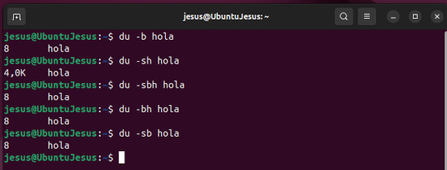

* **du -b hola**
   * Mostra la mida real en bytes del fitxer.
   * Vol dir que el fitxer ocupa 8 bytes reals de dades.
     Aquesta és la mida del contingut del fitxer, no l’espai reservat al disc.

* **du -sh hola**
   * **-s:** mostra només el total resumit (sense detallar carpetes internes)
   * **-h:** mostra la mida en format humà (K, M, G...).
Indica que el fitxer ocupa un bloc de 4 KB al disc, tot i que només té 8 bytes de dades. Això passa per la fragmentació interna: el sistema de fitxers reserva un bloc sencer (4 KB) per al fitxer encara que no l’ompli.

* **du -sbh hola**
    * **-s:** resum total.
    * **-b:** mostra la mida en bytes.
    * **-h:** mostra la mida humana (en aquest cas no té efecte perquè -b té prioritat).
 Igual que **du -b**, mostra els 8 bytes reals de dades.

* **du -bh hola**
    * Equivalent pràcticament a l’anterior (du -sbh).
    * Mostra la mida real del fitxer en bytes, però no la mida que ocupa al disc.

* **du -sb hola**
    * **-s:** només el total.
    * **-b:** en bytes exactes.
De nou, indica la mida real de dades, no la de l’espai ocupat.

## Tipus de formateig

El formateig és el procés que prepara un dispositiu d’emmagatzematge per poder-hi desar dades. Hi ha diversos nivells segons la profunditat de l’operació:

### Formateig de baix nivell

* Escriu els sectors físics i defineix com es divideix el disc en pistes i sectors.
* El realitza el fabricant o programes de manteniment especials.
* Només s’utilitza per recuperar discs defectuosos o en diagnosi.
* En discs moderns ja no és recomanable fer-lo manualment.

### Formateig de mig nivell

* Reorganitza les àrees del disc i pot marcar sectors danyats per evitar-ne l’ús.
* Antigament s’usava com a pas intermedi entre el baix i l’alt nivell.
* Actualment, la majoria de sistemes no fan distinció i integren aquesta tasca en el formateig d’alt nivell.

### Formateig d'alt nivell

* Crea el sistema de fitxers (FAT, NTFS, ext4...) i les seves estructures de control (taules d’arxius, inodes, etc.).
* És el formateig habitual que fem des de Windows, macOS o Linux.
* Elimina les dades lògiques, però no sempre les físiques, de manera que poden ser recuperables amb programes especials.

## Gestió de particions

La gestió de particions consisteix a crear, eliminar, redimensionar o modificar les particions d’un disc dur.

Objectius principals:
* Separar sistemes operatius o dades.
* Millorar l’organització i la seguretat.
* Preparar nous discs o recuperar espai.
* Crear esquemes GPT/MBR segons la necessitat.

Els sistemes operatius moderns permeten fer-ho tant des de gràfics (com GParted o Gestor de discs de Windows) com des de la línia de comandes (fdisk, parted...).

### Creació del disc dur virtual i afegir-lo a la màquina virtual Ubuntu

Per a realitzar la part de les particions i formatacions, en primer lloc, es crearà una unitat de disc dur virtual de 25 GB, s’afegirà a la màquina virtual, i posteriorment es crearà el particionat i formatatge corresponent

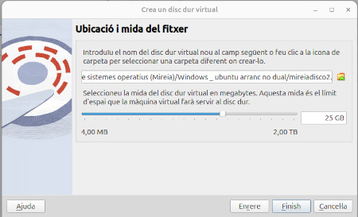

Imatge amb les dades de creació del disc dur virtual de 25 GB així com el nom i ruta d'accés del mateix

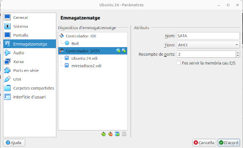

Imatge com queda la configuració de la màquina virtual després d'afegir el segon disc dur per a poder fer la pràctica. A continuació, s'arranca la màquina virtual i es procedeix a la comprovació de què el disc dur afegit apareix com a afegit al sistema.

### Comprovació del disc dur al sistema

Per tal de comprovar que el disc dur esta disponible al sistema, en primer lloc s'obrira el terminal de l'Ubuntu i es posara la comanda **fdisk -l** per tal de poder comprovar que aquest apareix i en quina ubicació del sistema es troba.

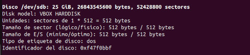

Des del terminal s'ha pogut comprovar com el disc dur creat apareix correctament al sistema, però com és normal cal preparar-lo per a treballar amb ell. Com es pot apreciar a la imatge, el disc dur apareix a la ruta **/dev/sdb**. Amb aquesta dada, ja es pot començar amb el particionat del disc i posterior formatatge.

També en aquest cas, com que es disposa de l'aplicació Gparted, també s'ha realitzat la mateixa comprovació però en aquest cas en format gràfic, i també ens mostra la mateixa informació que el terminal.

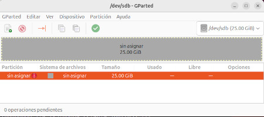

Comprovat que el nou disc dur ja està disponible, i que aquest es troba com a **/dev/sbd/**, es procedeix a la creació de les particions.

### Creació de les particions al nou disc dur

Comprovada la ubicació del disc dur es procedeix a la creació de les particions utilitzant la comanda **fdisk**.

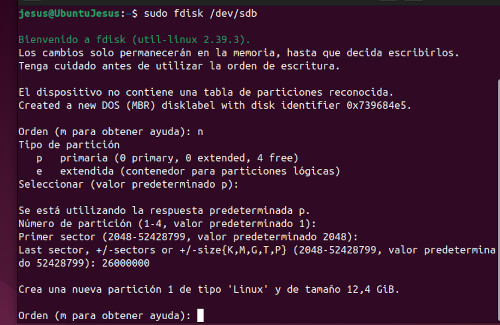

Les comandes utilitzades han estat les següents:
* **n:** Per a crear una partició nova
* **p:** Per a crear una partició primària
* **Número partició:** 1 per defecte en aquest cas, ja que és la primera que es realitza.
* **Primer sector:** per defecte, 2048 que es on comença el disc
* **Últim sector:** 26000000 al particionar el disc en dos, inicialment posem la meitat del disc aproximadament
I amb això ja tindríem la primera partició creada.

A continuació es crea la segona partició continuant des de dintre de la comanda fdisk ja que no cal sortir-ne.

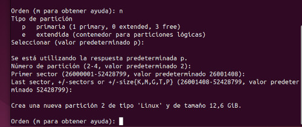

En aquest cas comencem de nou amb els mateixos passos que en el pas anterior.
* **n:** crear nova partició
* **p:** per a crear novament una partició primària
* **Número de partició:** 2 per defecte, ja que ja l'aplicació ja detecta que tenim la primera creada.
* **Primer sector:** en aquest cas ens mostra 260001408 que és on ha acabat la primera partició. 
* **Last sector:** en aquest cas ja és el final del disc dur i es polsa intro, ja que és el valor predeterminat i el correcte a inserir en aquest cas.

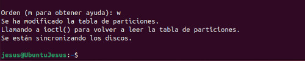

Després d’això ja tindríem les dues particions creades, únicament ens quedaria aplicar la comanda **w** per tal d’aplicar els canvis i sortir de la comanda fdisk

Després de realitzar aquests canvis es torna a posar la comanda fdisk -l per a comprovar com s’han realitzat els canvis al disc dur i on han d’aparèixer les dues particions creades si tot ha anat correctament.

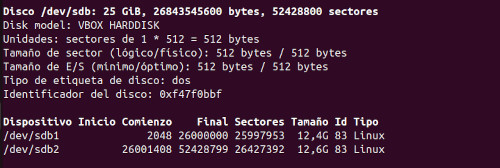

A la imatge es pot apreciar com al disc dur de 25 GB i que es troba a **/dev/sdb** ja apareixen les dues particions creades tal com s’ha realitzat amb la comanda **fdisk**. Però també una informació que ens mostra la comanda és la mida dels **sectors** del disc el qual ja ens mostra que els sectors o clústers són de **512 bytes**.

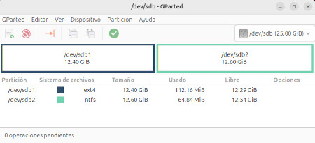

Si es volgués comprovar l’estat del disc dur per l’entorn gràfic, es tornaria a entrar a l’aplicació **Gparted** i després d’escollir el segon disc dur, aquest ja ens mostra correctament també la creació de les dues particions.

**Amb el particionat de discs** com es pot apreciar, tant es pot fer per **entorn gràfic** mitjançant amb aplicacions com **Gparted com pel terminal**, però s’ha de saber una cosa important que és per exemple que amb **Gparted no es pot modificar la mida del bloc**. Això vol dir que les aplicacions d’entorn gràfic no tenen les mateixes funcionalitats que les de línia d'ordres com fdisk.

## El proces de formatació del disc dur

Un cop s’ha dividit el disc dur en particions, és necessari formatejar-les abans de poder-les utilitzar. El formateig és el procés que **crea l’estructura lògica** (sistema de fitxers) que permet al sistema operatiu organitzar i desar dades dins de la partició.

Per tant, l’ordre correcte és:
* **Particionar el disc:** definir les àrees on s’emmagatzemaran dades o sistemes operatius.
* **Formatejar cada partició:** crear-hi el sistema de fitxers (com ext4, NTFS, FAT32...).
Sense aquest segon pas, el sistema operatiu no pot reconèixer ni utilitzar l’espai del disc.

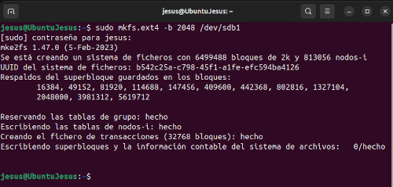

Per al formatatge de la primera partició i tal com s’aprecia a la imatge s’ha creat un sistema de fitxers **ext4** propi dels sistemes Linux. En aquest cas s’ha utilitzat el paràmetre -b 2048 que defineix la mida de bloc del sistema de fitxers a 2048 bytes en lloc del valor predeterminat de 4096 habitual en ext4. 

D’aquesta manera, cada bloc del sistema de fitxers pot emmagatzemar fins a 2 KB de dades, fet que pot millorar l’aprofitament de l’espai en fitxers petits, pero empitjorar-lo en algunes altres.

La comanda utilitzada ha estat: 
* sudo mkfs.ext4 -b 2048 /dev/sdb1

Formatada la primera partició amb un sistema de fitxers **ext4** de sistemes Linux, a continuació es procedirà al formatatge de la segona partició, que en aquest cas es realitzarà amb un sistema de fitxers **NTFS** propietari dels sistemes operatius Windows

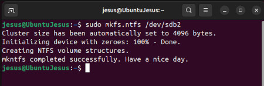

En aquest cas el formatatge s’ha realitzat amb els paràmetres per defecte. Com es pot apreciar a la imatge la mida del bloc o clúster és de **4096 bytes**, que és la mida per defecte que s’apliquen als sistemes de fitxers NTFS.

Si es volgués comprovar que el formatatge ha estat correcte i no hem realitzat cap error, es podria utilitzar la comanda **lsblk -f** la qual mostra totes les unitats del sistema aixi com la informació del sistema de fitxers.

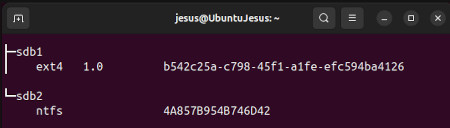

A la imatge es pot apreciar com si ens centrem en el disc dur /dev/sdb, ens apareixen les dues particions existents així com el seu sistema de fitxers de cadascuna. Però, per als que els agrada l’entorn gràfic, també es pot comprovar el resultat del formatge així com de les particions des de l’aplicació Gparted.

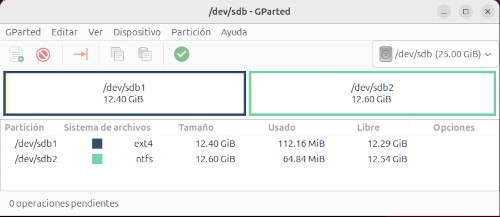

A la imatge, es pot apreciar com Gparted mostra les particions existents així com el sistema de fitxers de cadascuna d’elles.

## Observació dels valors existents a les particions creades

Arribats aquí, ja estan les dues particions amb els seus sistemes de fitxers creats, per la qual cosa ja tenim el disc dur apunt per a ser utilitzat i afegir les dades necessàries. Per acabar i per a comprovar tot el que s’ha vist fins aquí, ens queda visualitzar com han quedat els valors al final de tot el procés.

Per exemple per a poder veure els valors que hi ha a una partició amb format **ext4** com es el cas, es pot utilitzar la comanda **tune2fs**, que permet mostrar tots els valors com ara la mida dels blocs. Per a veure el resultat, la comanda seria:
* sudo tune2fs -l /dev/sdb1 | grep Block

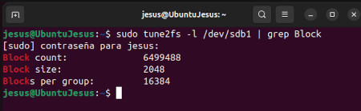

Amb aquesta comanda es pot apreciar el seguent:
* **Block count: 6499488**
Indica el nombre total de blocs que té el sistema de fitxers dins d’aquesta partició que en aquest cas es de 6499488
* **Block size: 2048**
Mostra la mida de cada bloc lògic del sistema de fitxers (definit en el moment del formateig), en aquest cas 2048. Per defecte, en ext4 la mida és 4.096 bytes (4 KB), però aquí s’ha canviat manualment amb el paràmetre -b 2048 al realitzar el formateig
* **Blocks per group: 16384**
Indica quants blocs formen cada grup de blocs dins del sistema de fitxers ext4. En ext4, els blocs s’organitzen en grups per millorar l’eficiència de la gestió i reduir la fragmentació. Aquí, cada grup conté 16.384 blocs (és a dir, 16.384 × 2.048 = 33.554.432 bytes ≈ 32 MB per grup).

Si el que es vol veure és la informació sobre el **sistema de fitxers NTFS** és necessària una altra comanda, ja que la primera com ja s’ha dit només es valida per a sistemes de fitxers **ext4**. La comanda a utilitzar finalment ha estat:
* sudo ntfsinfo -m /dev/sdb2 | grep -A 15 "Volume Information"

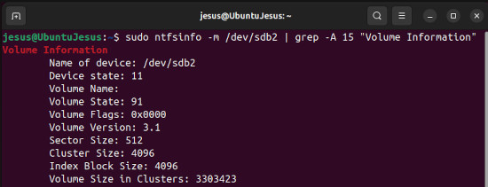

Tal com s’aprecia a la imatge es pot apreciar entre altres que la mida del **sector físic és de 512 bytes** que és el que ha agafat al crear la partició, mentre que la mida del **sector lògic ha quedat en 4096 bytes**. Això indica que un clúster (logic) agrupa diversos sectors físics per formar la unitat mínima que utilitza el sistema operatiu per desar un fitxer.

## Muntatge de particions al sistema

Quan es crea una nova unitat de disc a Linux, aquesta no és accessible directament pel sistema operatiu. Per poder accedir-hi i treballar amb els seus fitxers, cal muntar-la en un punt concret del sistema de fitxers.

Aquesta tasca es realitza mitjançant la comanda **mount**, que permet associar una partició o dispositiu amb un punt de muntatge (directori) dins de l’estructura del sistema. Un cop muntada, la unitat esdevé accessible com si fos una carpeta més del sistema.

A Linux, totes les unitats de disc formen part d’una única jerarquia de directoris.  Per aquest motiu, quan es crea una nova partició o s’afegeix un dispositiu d’emmagatzematge, aquest no és accessible automàticament fins que s’hi realitza el muntatge.

El muntatge consisteix a enllaçar el sistema de fitxers de la unitat amb un punt de muntatge dins de l’arbre principal (/). Això es pot fer manualment amb la comanda:

* sudo mount /dev/sdb1 /mnt

on /dev/sdb1 és la partició i /mnt és el directori on quedarà accessible. A partir d’aquest moment, el contingut de la unitat pot ser llegit i modificat com qualsevol altra carpeta del sistema.

Quan s’ha acabat de treballar amb una unitat o dispositiu muntat, és recomanable desmuntar-lo correctament per assegurar que totes les dades s’hagin escrit al disc i evitar possibles errors o corrupcions. La comanda a utilitzar seria:
* sudo umount /dev/sdb1

Quan una unitat està desmuntada, ja no és accessible pel sistema operatiu fins que es torni a muntar. Si la unitat està en ús (per exemple, si hi ha un fitxer obert dins d’ella), la comanda umount mostrarà un error del tipus "target is busy". En aquest cas, cal tancar els fitxers o processos que l’estiguin utilitzant abans de desmuntar-la.

### Muntatge i desmuntatge manual

El muntatge manual es realitza mitjançant el terminal, utilitzant la comanda mount. En aquest cas la comanda seria:
* sudo mkdir /mnt/sdb1
* sudo mount /dev/sdb1 /mnt/sdb1

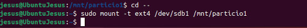

Amb aquesta comanda s’indica al sistema que munti la partició **/dev/sdb1** al directori **/mnt/sdb1**, fent que el seu contingut sigui accessible des d’aquest punt del sistema de fitxers. És recomanable crear un subdirectori dins de **/mnt** amb el nom de la partició o un nom descriptiu, per tal de mantenir una estructura més clara i organitzada.

Així, la partició queda muntada en un directori específic, facilitant-ne la identificació i l’accés. En el cas del desmuntatge quan s’ha acabat de treballar amb la unitat muntada, és important desmuntar-la correctament per assegurar que totes les dades s’hagin escrit al disc i evitar possibles errors o corrupcions. La comanda a utilitzar seria.

* sudo umount /dev/sdb1

Quan es treballa amb muntatges manuals, cal tenir en compte que el **muntatge realitzat d’aquesta manera és temporal**, no queda registrat al sistema i, per tant, **desapareix automàticament en reiniciar l’equip**. Si es vol que una unitat es munti automàticament en cada inici, cal afegir-ne la configuració al fitxer fstab, on es defineixen els muntatges permanents.

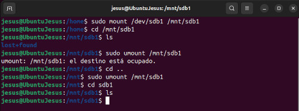

A la imatge es pot apreciar tot el procés de muntatge i desmuntatge de la partició **/sdb1** dintre de **/mnt**. Abans s’ha creat ja la carpeta sdb1. El procés es pot apreciar com un cop muntada la partició, aquesta si s’accedeix mostra el seu contingut (carpeta lost+found).

A continuació es procedeix al desmuntatge amb la comanda **umount**, però aquesta no ha estat permesa donat que estem a l'interior, no és possible desmuntar-la, per la qual cosa ja ens mostra l’error corresponent. Després de sortir-ne es torna a utilitzar la comanda umount aquesta vegada de forma correcta. En tornar a entrar a la carpeta **/mnt/sdb1**, ja es pot apreciar com ja no apareix la carpeta de la unitat i mostra el contingut de la carpeta **/mnt/sdb1** que en aquest cas no hi ha contingut.

Tot i que el muntatge manual es pot fer mitjançant la comanda mount des del terminal, els entorns d’escriptori moderns com GNOME, KDE Plasma o XFCE permeten muntar particions i dispositius externs gràficament, sense necessitat d’utilitzar ordres.

Quan es connecta un dispositiu (com una memòria USB o un disc dur extern), el sistema detecta automàticament la unitat i ofereix l’opció de muntar-la amb un sol clic des del gestor d’arxius (per exemple, Nautilus, Dolphin o Thunar). Un cop muntada, la unitat apareix en la barra lateral del gestor de fitxers i és accessible com qualsevol altra carpeta.

Internament, el sistema realitza el mateix procés que la comanda mount, però de manera automàtica i temporal. Aquest tipus de muntatge no és permanent i desapareix quan s’expulsa el dispositiu o s’apaga l’equip.

Quan es munta una unitat des del gestor d’arxius (com Nautilus a GNOME o Dolphin a KDE), el sistema utilitza un servei intern anomenat udisks2, que realitza la comanda mount automàticament amb permisos d’usuari, no de root.
Per defecte, les unitats muntades gràficament es col·loquen a:

* /media/<nom_usuari>/<NomDelDispositiu>/

Per a desmuntar només cal fer un clic amb el botó de la dreta al damunt de la unitat, i ja apareix la comanda per a desmuntar.

### Muntatge automàtic amb fstab

Per tal d’evitar haver de muntar manualment les unitats cada vegada que s’inicia el sistema, Linux utilitza un fitxer especial anomenat **fstab (File System Table)**. Aquest fitxer conté la informació necessària perquè el sistema operatiu munti automàticament les particions o dispositius en iniciar-se. Cada línia del fitxer fstab defineix una unitat, el seu punt de muntatge i les opcions associades. 

Tanmateix, el muntatge automàtic només té realment sentit en aquells casos en què la partició o unitat s’utilitza de manera continuada o permanent dins del sistema.  Per exemple, en particions que contenen directoris importants com /home, /var, /srv o carpetes de dades que el sistema o els serveis necessiten des del moment de l’arrencada.

En canvi, per a dispositius externs o d’ús esporàdic (com discs USB, discos durs externs o unitats de còpia de seguretat), no és recomanable afegir-los a fstab. En aquests casos, és preferible realitzar un muntatge manual quan sigui necessari, o deixar que l’entorn gràfic del sistema (GNOME, KDE, etc.) gestioni automàticament el muntatge quan es connecti el dispositiu.

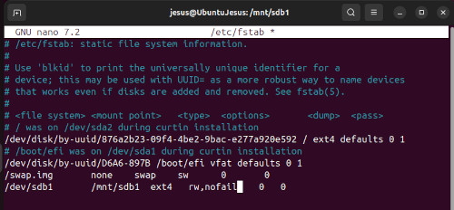

A l'última línia del fitxer fstab es pot apreciar com s’ha afegit una línia amb els paràmetres mínims necessaris perquè el muntatge de la partició es realitzi de forma automàtica en iniciar el sistema. En aquest cas la línia inserida ha estat la següent.

* /dev/sdb1   /mnt/sdb1   ext4    rw,nofail 0   0

Els paràmetres utilitzats són els següents.
* **/dev/sdb1**	Indica quin és el dispositiu físic a muntar
* **/mnt/sdb1**	Indica el punt on es muntarà el disc a muntar
* **ext4** Indica el sistema de fitxers de la partició a muntar
* **rw,nofail**	Indica que es muntarà amb permisos de lectura i escriptura i que permet evitar els errors en cas que el disc no hi sigui
* **0 0**	indica Dump i fsck que no cal fer comprovacions d’arrancada.

Quan es treballa amb el fitxer /etc/fstab (File System Table) s’ha de tindre molta cura, ja que és el responsable d’indicar al sistema quines particions, dispositius o unitats de xarxa s’han de muntar automàticament en iniciar Linux, i en quin punt del sistema de fitxers s’han de connectar.

Cada línia del fitxer defineix una entrada de muntatge amb diversos paràmetres: el dispositiu o UUID, el punt de muntatge, el tipus de sistema de fitxers i les opcions de muntatge. Tot i ser molt útil, editar el fitxer fstab pot comportar certs riscos si no es fa correctament.

Si el directori especificat com a punt de muntatge no existeix, el sistema no podrà muntar la partició i mostrarà un error. Crea el directori abans de muntar. Si la unitat és externa o no sempre està present, cal afegir l’opció nofail a la línia del fstab. Això evita que l’arrencada s’aturi si el dispositiu no es troba. Un sol espai de més o un camp mal escrit pot fer que el sistema no pugui llegir correctament fstab i no arrenqui

Algunes opcions poden restringir l’accés o fer que el sistema no pugui escriure al dispositiu (ex: ro = read-only, noexec, etc.). El fitxer /etc/fstab és una eina molt potent que permet automatitzar el muntatge de particions, però també pot ser una font de problemes si s’edita sense precaució.

## Fragmentació dels sistemes de fitxers (ext4 i NTFS)

La fragmentació és un fenomen que es produeix quan les dades d’un fitxer no s’emmagatzemen de manera contigua al disc, sinó disperses en diferents blocs o clústers. Això pot afectar el rendiment d’accés als fitxers, especialment en discs durs mecànics (HDD).

Tot i que la fragmentació pot aparèixer en qualsevol sistema de fitxers, el seu impacte i gestió varien segons el tipus: NTFS (Windows) i ext4 (Linux).

Com ja s’ha comentat al principi del document existeix la fragmentació interna es la que es produeix dins dels blocs o clústers. Succeeix quan un fitxer no omple completament el bloc assignat, deixant espai desaprofitat dins d’ell.
I per l’altre costat està la fragmentació externa que apareix quan els fitxers es divideixen en fragments que es guarden en blocs no contigus al disc. Això passa quan s’esborren o creen molts fitxers i l’espai lliure es dispersa, etc.

### Fragmentació en NTFS (Windows)

NTFS tendeix a fragmentar-se amb el temps perquè:
* No sempre pot col·locar els fitxers grans en blocs contigus.
* L’espai lliure es fragmenta amb les operacions d’escriptura i esborrat.

Windows inclou una eina de desfragmentació automàtica (“Desfragmentar i optimitzar unitats”). En discs SSD, aquesta eina no desfragmenta sinó que executa l’ordre TRIM, que optimitza l’ús dels blocs.

### Fragmentació en ext4 (Linux)

El sistema de fitxers ext4 està molt optimitzat per evitar la fragmentació externa pel següent:
* Reserva espai addicional entre fitxers per permetre que puguin créixer sense trencar la contigüitat.
* Utilitza un sistema anomenat extents, que guarda trams contigus de blocs junts.
* Distribueix els fitxers en diferents grups de blocs per minimitzar la fragmentació.
En ús normal, ext4 manté una fragmentació inferior al 2%, fins i tot després de molt temps. Amb ext4, no cal desfragmentar manualment, tot i que existeixen eines com e4defrag per optimitzar un sistema molt ple o molt antic.

### La comanda e4defrag

Com ja s’acaba de dir, per a desfragmentar una unitat amb **ext4** hi ha la comanda **e4defrag**. Aquesta comanda funciona de manera que si detecta que la unitat no necessita desfragmentació, no realitza cap moviment, i si aquesta detecta una fragmentació excessiva, aquesta realitza una desfragmentació de la partició. La comanda per aplicar-la seria la següent:

* sudo e4defrag -c /mnt/sdb1

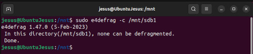

El sistema de fitxers està completament optimitzat, e4defrag ha analitzat tots els fitxers dins de **/mnt/sdb1** i ha trobat que cap d’ells no està dividit en blocs separats.

## Particions i volums

Quan es parla de particions i volums cal, en primer lloc, tindre clar el concepte de cada cosa. Per un costat hi ha la partició, aquesta és una divisió lògica dins d’un dispositiu d’emmagatzematge físic (com un disc dur, SSD o memòria externa). Mitjançant el particionat, es pot organitzar millor l’espai del disc, separant dades o sistemes diferents dins del mateix dispositiu. 

Cada partició es comporta com si fos un disc independent i pot tenir el seu propi sistema de fitxers (NTFS, ext4, FAT32, etc.). Per exemple, un mateix disc físic pot tenir una partició per al sistema operatiu i una altra per a les dades de l’usuari.

I per l’altre costat es troben els volums, un volum és una unitat lògica d’emmagatzematge que el sistema operatiu pot muntar i utilitzar per llegir o escriure dades. És el que l’usuari veu com una unitat accessible (com ara C:, D: o /home). Cada volum correspon, generalment, a una partició, però també pot estar format per diverses particions o diversos discs combinats.

Per tant, per a entendre les diferències entre una relació i una partició i un volum es pot dir el següent:
* Una partició és una divisió del disc físic.
* Un volum és la unitat lògica creada a partir d’una o més particions.
* Normalment, hi ha una relació d’1 a 1 (una partició = un volum), però en sistemes més avançats (com LVM o RAID) diverses particions poden formar un únic volum, o un volum pot estar repartit en diversos discs físics.
